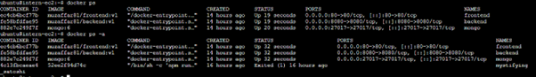
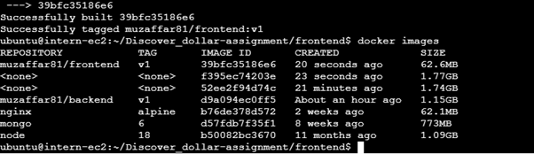
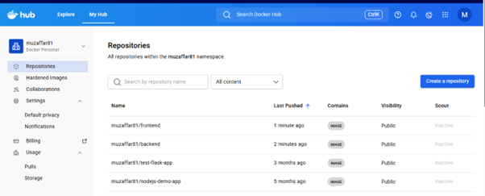

# DevOps Engineer Internship Assignment

## 📌 Project Overview

This project demonstrates the deployment of a full-stack MEAN (MongoDB, Express, Angular 15, Node.js) application using Docker, Docker Compose, and GitHub Actions CI/CD on AWS EC2.

The application manages tutorials with full CRUD functionality.

---

## 🏗️ Architecture

GitHub → GitHub Actions → Docker Hub → AWS EC2 → Docker Compose → MongoDB + Backend + Frontend

### Services:

- MongoDB (Database)
- Node.js + Express (Backend API)
- Angular 15 (Frontend)
- Nginx (Frontend serving via port 80)

---

## 🐳 Containerization

### Backend
- Base Image: node:18
- Exposed Port: 8080
- Installed dependencies via npm install

### Frontend
- Multi-stage Docker build
- Stage 1: Angular production build
- Stage 2: Nginx alpine image (optimized 60MB image)

---

## 🐙 Docker Compose

Three services are defined:

- mongo
- backend
- frontend

Containers communicate using Docker internal network (service name `mongo` used instead of localhost).

Run locally:

```bash
docker compose up -d

---

## ☁️ AWS Deployment

- EC2 Instance: Ubuntu (Free Tier - t2.micro/t3.micro)
- Docker & Docker Compose installed
- Security Group allows:
  - Port 80 (HTTP)
  - Port 22 (SSH)
  - Port 8080 (Backend - optional)
  - Port 27017 (MongoDB - optional)

Application is accessible via:

http://<EC2-PUBLIC-IP>

---

## 🔄 CI/CD Pipeline (GitHub Actions)

The CI/CD pipeline is configured using GitHub Actions.

### Trigger:
- On push to `main` branch

### Pipeline Steps:
1. Checkout repository
2. Login to Docker Hub using GitHub Secrets
3. Build backend Docker image
4. Push backend image to Docker Hub
5. Build frontend Docker image (multi-stage)
6. Push frontend image to Docker Hub
7. SSH into EC2
8. Run:
   docker compose down
   docker compose pull
   docker compose up -d

This ensures automatic deployment after every push.

---

## 🔐 GitHub Secrets Used

- DOCKER_USERNAME
- DOCKER_PASSWORD
- EC2_HOST
- EC2_USER
- EC2_SSH_KEY

---

## 📸 Screenshots

### Docker Containers Running


### Docker Images Built


### Images Pushed to Docker Hub


### Docker Hub Repositories


### GitHub Actions Successful Run


### Application UI


---

## 🎯 Key DevOps Concepts Demonstrated

- Docker containerization
- Multi-stage Docker builds
- Docker Compose orchestration
- Service-to-service networking
- AWS EC2 deployment
- CI/CD automation
- Infrastructure persistence (as required in assignment)

---

## ✅ Final Result

The full-stack MEAN application is successfully:

- Containerized
- Deployed on AWS EC2
- Exposed via port 80
- Automated using GitHub Actions CI/CD
- Ready for live demonstration
